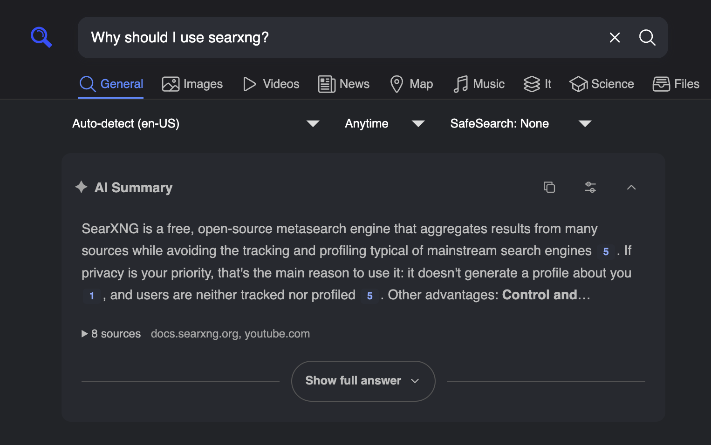

# AI overviews for SearXNG

Add streaming, source-linked answers above SearXNG search results. End a search
with `?` to generate a summary from the returned snippets, using a local model
or a hosted provider. Ordinary search results remain available while it runs.



- Numbered citations open the source snippets used for the answer.
- Markdown answers include copyable code blocks with syntax highlighting.
- Stop, retry, regenerate, and optionally switch between configured models.
- Fits SearXNG's Simple theme, including dark mode and mobile layouts.

**Early-stage software for personal instances.** Tested with SearXNG
`2026.9.19-e831fc2a1` and the Simple theme. Other versions and themes are
unverified. The conversation API supports follow-ups, but the current interface
hides the follow-up input.

[Provider configuration](docs/providers.md) ·
[Development and testing](docs/development.md) ·
[Architecture](docs/ARCHITECTURE.md)

## Try it without a model

Requires Python 3.11+, [uv](https://docs.astral.sh/uv/), and Make:

```sh
git clone https://github.com/jacobabahn/ai-overview-searxng.git
cd ai-overview-searxng
uv sync --locked
make demo
```

Open <http://127.0.0.1:8765>. The demo uses prerecorded fixture answers; it needs
no SearXNG instance, API key, or model server.

## Install in SearXNG

These steps assume an existing Docker Compose deployment using the Simple theme
and SearXNG's class-based plugin API. Keep your existing search configuration.
Python and uv are needed for the standalone demo and development, not on the
host for this container installation.

### 1. Configure a model

Clone this repository if you have not already. Choose either environment
variables for one model or a YAML file for multiple profiles and advanced settings.

**Environment variables — no `overview.yml` needed:** add these to your SearXNG
service in Docker Compose:

```yaml
environment:
  AI_OVERVIEW_BACKEND: ollama
  AI_OVERVIEW_MODEL: your-installed-model
  AI_OVERVIEW_ENDPOINT: http://host.docker.internal:11434/api/chat
```

**YAML configuration:** create `overview.yml` in the repository root. The equivalent
Ollama configuration is:

```yaml
default_profile: ollama
profiles:
  ollama:
    backend: ollama
    model: your-installed-model
    endpoint: http://host.docker.internal:11434/api/chat
```

Replace `your-installed-model` with the exact name from `ollama list`. The model
server must listen on an address reachable from the container; container
`localhost` refers to the container itself.

For OpenAI-compatible local servers, OpenAI, Gemini, OpenRouter, or OpenCode Go,
see [provider configuration](docs/providers.md) and
[the complete configuration example](examples/overview.yml). Model IDs must be
available in your installation or provider account. There is no automatic fallback
to another provider.

### 2. Mount the plugin and configuration

Add the following to your existing SearXNG service, replacing the host paths:

```yaml
extra_hosts:
  - "host.docker.internal:host-gateway"
volumes:
  - /absolute/path/ai-overview-searxng/src/ai_overview:/usr/local/searxng/ai_overview:ro
```

If you chose YAML configuration, also add this volume:

```yaml
  - /absolute/path/ai-overview-searxng/overview.yml:/etc/searxng/overview.yml:ro
```

For a hosted provider, also pass the API key through the container environment
using `AI_OVERVIEW_API_KEY` in environment mode, or the provider's standard
variable such as `OPENAI_API_KEY`. YAML profiles can choose a variable with
`api_key_env`.
Credentials stay on the server. Local profiles need no key unless their server
requires one.

[compose.env.example.yml](compose.env.example.yml) shows the environment-only
setup; [compose.example.yml](compose.example.yml) shows the YAML setup. Both
expect your complete SearXNG `settings.yml` in the repository root. Only the YAML
setup needs `overview.yml`; both private paths are ignored by Git. Pin your
SearXNG image version or digest.

### 3. Enable the plugin

Merge these entries into your SearXNG `settings.yml`, preserving any existing
plugins and outgoing settings:

```yaml
plugins:
  ai_overview.plugin.SXNGPlugin:
    active: true
outgoing:
  networks:
    ai_overview:
      enable_http: true
      retries: 0
```

The dedicated network permits local HTTP model endpoints and inherits SearXNG's
proxy and TLS settings. Set `enable_http: false` if all model endpoints use HTTPS.
Keep a strong random `server.secret_key` of at least 24 characters. If you use
another AI-answer plugin, disable it to avoid duplicate panels.

### 4. Restart and search

Recreate your SearXNG service to apply the mounts and environment:

```sh
docker compose up -d --force-recreate searxng
```

Run this from your deployment directory; substitute your service name if needed.
Search the first page of General results for `why is the sky blue?`. If saved
browser preferences override the default, enable **AI overview** in Preferences.
With YAML configuration, set `model_picker: true` to expose configured profiles under
**Summary settings**. Restart SearXNG after changing configuration.

For non-container installations, install this repository into SearXNG's Python
environment with `pip install /path/to/ai-overview-searxng`, then apply the same
plugin settings. The default config path is `/etc/searxng/overview.yml`; override
it with `AI_OVERVIEW_CONFIG` in the SearXNG process environment. Environment-only
configuration works there too.

Configuration precedence: an explicit `AI_OVERVIEW_CONFIG` path wins; otherwise
`AI_OVERVIEW_BACKEND` selects environment mode; otherwise the default YAML path
is loaded. Sources are not merged, and invalid configuration does not fall back.

## Privacy and limitations

The selected provider receives your question and selected search snippets. Hosted
providers receive that data even when SearXNG itself is self-hosted. Local model
profiles keep generation on the configured server. Search-engine requests still
follow your SearXNG settings.

- Generation starts only for HTML, first-page, General-category searches ending
  in an ASCII `?`, after trimming whitespace.
- Answers use bounded snippets, not full pages. Citations identify supplied
  sources; they do not prove that an answer is correct or supported.
- Model HTML is displayed as text. Markdown links display their labels; clickable
  citations resolve only to the supplied sources.
- Signed state is readable and held in page memory. Reloading starts fresh.
  State expires after 30 minutes by default and can be replayed until expiry.
  Only the selected model preference is saved in local storage.
- Defaults allow 8 sources, 12,000 bytes of evidence, and 2 simultaneous
  generations **per worker**. There are no shared admission or per-user spending
  controls for public instances.
- Stop closes the browser request. Upstream cancellation depends on server
  disconnect detection and provider behavior and may take until a timeout.
- Automated checks use provider fixtures. Live compatibility with every backend
  and model, and systematic answer-quality evaluation, remain unverified.

The retained follow-up API also sends conversation context to the provider and
can perform one additional search per turn. Its budgets and state handling are
covered in [Architecture](docs/ARCHITECTURE.md).

## Troubleshooting

| Symptom | Check |
| --- | --- |
| No summary panel | Simple theme, plugin enabled in Preferences, first page of General results, and a trailing `?`. Check SearXNG logs for configuration errors. |
| Configuration error | YAML paths and permissions, a valid `default_profile`, and a strong `server.secret_key`. Restart after edits. |
| Local model unreachable | Test the endpoint from inside the container. Enable HTTP on the `ai_overview` network for HTTP endpoints. |
| Answer arrives all at once | Disable reverse-proxy buffering for `/ai-overview/stream` and set its read timeout longer than the configured generation timeout. |
| Summary stays busy | The worker has reached its generation limit. Automatic retries are bounded; wait for active requests to finish or use Retry. |

## Development

See [development and testing](docs/development.md) for local checks, real SearXNG
integration tests, and packaging. Bug reports should include the SearXNG version,
backend, model ID, and reproduction steps. Omit credentials and private search
content.

## License

[MIT](LICENSE). Bundled [Marked](src/ai_overview/static/marked.LICENSE.txt) and
[Highlight.js](src/ai_overview/static/highlight.LICENSE.txt) retain their own
license notices.
