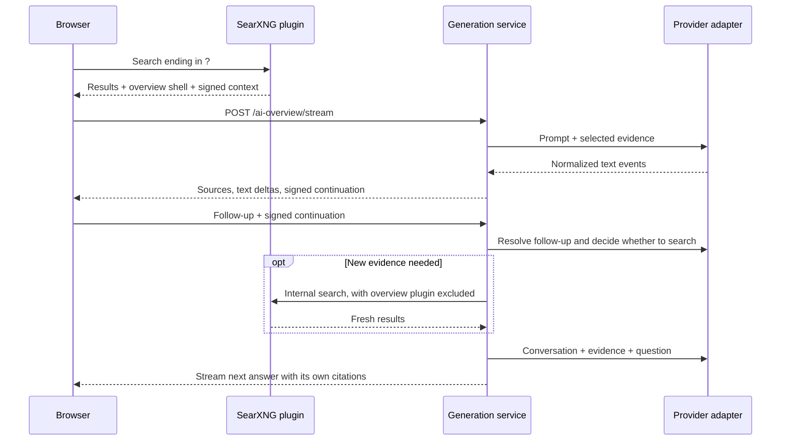

# Architecture

## Decision

Build an installable Python package loaded by SearXNG, with separate JavaScript
and CSS assets. Target the Simple theme and Docker Compose. Start with snippets.
The initial integration was developed against SearXNG revision `e831fc2a1`.
Use a separate test instance when validating compatibility with other revisions.



## Boundaries

- `plugin.py`: SearXNG lifecycle, query eligibility, initial result snapshot,
  and internal follow-up searches. SearXNG imports are confined to this module
  and the SearXNG HTTP transport implementation.
- `web.py`: Flask blueprint, request validation, signed state, streaming response,
  and packaged static assets. Can run in a development app without SearXNG.
- `evidence.py`: normalize and deduplicate HTTP(S) sources; bound snippet context.
- `service.py`: prompt construction, follow-up planning, evidence selection,
  normalized events, and successful conversation updates.
- `providers/`: request translation and incremental response parsing for Chat
  Completions, Responses, Gemini, and Ollama's native chat protocol.
- `config.py`: configuration loading, named profiles, server-side credentials, and limits.
- `routing.py`: provider defaults, model/protocol routes, endpoint selection, and
  compatible options, shared by initial configuration and signed selections.
- `catalog.py`: cached Go model discovery, documented protocol routes, and
  validation of model choices before signing a new conversation.
- `static/conversation.js`: request ordering, model selection, retry, cancellation,
  and signed continuation ownership, independent of the DOM. Selection and its
  restarted generation reserve one operation; only completed answers advance state.
- `static/overview.js`: DOM rendering, turn-specific citations, and controls derived
  from conversation state. Catalog loading can proceed alongside initial generation.
- `static/`: packaged browser modules and scoped theme-aware styles; no build step.

Use typed dataclasses for profiles, sources, search options, conversations,
turns, messages, and events. Use uv for dependencies, Ruff for formatting,
imports, linting, and required annotations, and ty for static type checks.
Ordinary optional values use `typing.Optional[T]`. Ruff's `UP045` rule is disabled
to preserve this convention. Stream failures currently use typed
exceptions; an Option/Result library has been discussed but not adopted.
Use small explicit interfaces. No agent
framework, vector database, or frontend build pipeline is needed for this scope.

## State and authorization

The initial search creates a short-lived, signed envelope containing the query,
selected sources, search options, profile name, and random conversation ID.
After a successful answer, return a newly signed continuation containing a
bounded transcript and the most recent evidence. Never accept client-supplied
provider settings, source bundles, or assistant history independently of it.

The envelope is readable, not encrypted. It lives in page memory, never the URL
or persistent browser storage. It is a bearer capability and can be replayed
until expiration. Require same-origin JSON requests and bound request size,
turn count, generation time, output size, and per-worker concurrency. This fits
the private-instance target; public deployment would need shared admission
controls. Tokens use a purpose-specific signing salt and a configured secret.

Only complete answers advance conversation state. Cancellation or failure keeps
the last successful continuation for retry. Each displayed turn retains its own
source map; citations cannot silently change when follow-ups retrieve new pages.

## Providers and transport

| Profile backend | Initial protocol |
| --- | --- |
| OpenAI | Responses |
| OpenRouter | Chat Completions |
| Local compatible server | Chat Completions |
| OpenCode Go | Chat Completions, Responses, or Anthropic Messages for the selected model |
| Gemini | Native streamed generateContent |
| Ollama | Native streamed chat |

Profiles declare model IDs explicitly. Extra provider parameters are restricted
so they cannot replace messages, streaming mode, endpoints, or model selection.
Credentials come from environment variable references. No automatic fallback.
Local inference never implicitly contacts a hosted model service.

`model_picker: true` adds a selector. `discover_models: true` on a Go profile
loads the public catalog through the same configured network without sending
API keys. The catalog lacks protocol metadata, so use documented model-to-protocol
mappings plus operator overrides. Unknown routes are disabled. Successful lists
are cached per worker for five minutes; failed refreshes retain old/configured
choices with a warning and a short retry delay.

`POST /ai-overview/models` and `/select` require signed search state and same-origin
requests. Selection is allowed only from initial state and the server's choice
list; it returns a signed model/protocol and fresh conversation ID. The stream
endpoint never accepts an unsigned model or endpoint override. Only the chosen
profile/model preference is persisted in local storage.

HTTP transport is injectable: use SearXNG's network layer in the plugin to retain
its proxy/TLS policy, and HTTPX for standalone development and adapter testing.
SearXNG uses a configured `outgoing.networks.ai_overview` network to support
local HTTP endpoints without enabling HTTP for unrelated engine requests.
Both feed byte chunks into bounded incremental SSE/NDJSON parsers. A provider
must report successful completion; unexpected EOF is an interrupted answer.
Provider payloads and credentials are never included in browser errors.

## Follow-ups and budgets

Initial generation uses the existing search results without another search or
planning request. A follow-up makes a small planning request to the same profile,
asking for a standalone search query or a decision to reuse evidence. This uses
plain JSON text, not model tool calls. Invalid plans fall back to a bounded search
using the original query and follow-up. Limit retrieval to one search per turn.

Generation owns one absolute monotonic deadline per turn, shared by planning
and answer requests. Retrieval receives the remaining allowance, capped by its
existing search timeout. Each stage checks the budget before starting, and late
completion cannot produce a signed continuation. Network adapters cap their I/O
timeouts to the remaining allowance when each request starts and check the deadline
between chunks. Blocking I/O can still take until its timeout to return; this is
cooperative enforcement, not immediate remote cancellation.

Use conservative UTF-8 byte budgets for prompt input, plus provider output-token
limits and explicit stream/output bounds. These are not exact tokenizer counts;
the operator must fit the profile to the chosen model. Do not truncate the latest
question or silently remove conversation turns: stop at the configured limit
and invite a new search. Context passed to the model retains source snapshots
for prior turns so old citation numbers remain interpretable.

## Browser contract

Use `fetch` with a POST body and streaming SSE response. Events are `status`,
`sources`, `text_delta`, `done`, and `error`. A `done` event includes the next
signed continuation. AbortController handles Stop and page navigation.

Render a limited Markdown subset with DOM nodes: paragraphs, headings, lists,
emphasis, blockquotes, and code. Marked supplies the lexer; model-provided HTML
stays literal text, and Markdown links display only their labels. Validated
numeric citations become source links in prose, never in code. Code blocks offer
copy controls and syntax highlighting through vendored Highlight.js grammars.
See [Markdown rendering](development.md#markdown-rendering) for dependency and
rendering details. Display partial answers on failure with an explicit status.
Screen readers receive status updates rather than announcements for every token.

Visual direction: inherit SearXNG typography and CSS colors; fallbacks are white
`#ffffff`, text `#222222`, muted text `#555555`, link blue `#3050ff`, and border
`#d8d8d8`. Use a left-aligned reading column and a compact source list. Citations
are the visual emphasis. Avoid decorative cards, animation, and external fonts.

```text
AI overview                                  Collapse
Short answer with citations [1] [2]

Sources (expand for titles and links)
----------------------------------------------------
Ask a follow-up…                                Ask
```

## Build and verification

1. Implement configuration, evidence, signed state, and protocol adapters.
2. Connect the complete overview/follow-up flow to a standalone fixture demo.
3. Add the SearXNG plugin and test against the installed image in isolation.
4. Provide Compose settings, provider examples, and instructions to replace the
   reference plugin once the new integration is ready.

`make check` includes dependency-free Node tests of the conversation interface,
using controlled fetch responses for selection/retry overlap, cancellation, saved
preferences, and token advancement. Python tests use a controlled clock for the
whole-turn deadline and exercise shared routing through configuration and selection.

Test fragmented UTF-8/stream frames, normal completion and truncation, timeouts,
token tampering/expiry, empty evidence, source sanitization, follow-up retrieval,
and browser cancellation. Exercise the real SearXNG integration with a local
mock provider before using live credentials. Live provider/model verification
remains separately recorded; fixtures cannot establish account access or answer
quality.

## Sources

- [SearXNG plugin API](https://docs.searxng.org/dev/plugins/development.html)
- [OpenAI streaming](https://developers.openai.com/api/docs/guides/streaming-responses)
- [Gemini generation API](https://ai.google.dev/api/generate-content)
- [Ollama chat API](https://docs.ollama.com/api/chat)
- [OpenRouter chat API](https://openrouter.ai/docs/api/api-reference/chat/create-a-chat-completion)
- [OpenCode Go](https://opencode.ai/docs/go/)


## Selected summary UI

The user selected prototype D: a transparent, full-column AI Summary with a sparkle
icon, compact toolbar, per-answer source pills, and centered More/Less control.
The initial answer previews four lines; More reveals the full conversation and
follow-up form. Citations and pills expand the relevant turn's source snippets.
Motion respects reduced-motion preferences. The generated-from-snippets footer was
removed at the user's request.

The full layout study is preserved on Git branch `prototype/overview-layouts`
(commit `24ab31f`). The runtime has no prototype assets, flags, or variant switcher.
